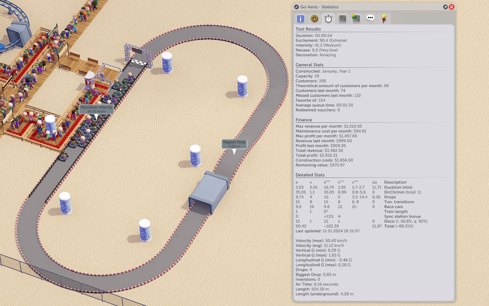

# AdvancedTrackedRideStats

This mod adds a table to Detailed Stats section with breakdown of different stats, their contribution to the Excitement score, and the game's expectations.

It can be used to figure out why the game disagrees with your ride being cool,
or to explore how different ride designs affect their metrics.

## Legend

| Column | Description |
| --: | :-- |
| e | Stat's current excitement contribution
| v | Stat's current value
| emax | Stat's supposed maximum excitement contribution
| vmax | Stat's value that produces the aforementioned maximum contribution
| vnear | Value range that scores 95% or more of maximum excitement. You can change this threshold in the mod settings.
| Δe | Difference between the current contribution and maximum contribution.

### Direction Changes Per Minute

Shown as DirCh/min, Parkitect registers a direction change as following:
> If the vehicle is currently withstanding a lateral G-force of more than 0.1G,  
> And the sign of the current lateral G-force is different to the last recorded one,  
> Then increment the direction changes counter and store the current lateral G-force.

This has a few implications:
- It's possible to register a direction change by shaking the vehicle a little bit.  
  (by building banked tracks)
- Sufficiently slow, gentle turns will not register as a direction change.
- The first left/counter-clockwise turn(s) will not register as a direction change because initial stored force (0) is positive.  
  In other words, a ride with left turns only has 0 direction changes, but a ride with right turns only has 1.

For your convenience, the total number of direction changes is displayed.

### Train length

I haven't figured out a way to calculate maximum train length per ride type,
so I'm assuming that you've set it to an appropriate value.

### Total

This is an _approximate_ maximum excitement value -
that is, if you were to add up the maximum contributions from each stat.

Depending on the ride, it may be impossible or impractical to build a design that
maxes out all of the stats at once.

And remember - efficiency isn't just about excitement.

## Known issues

- Some stats (e.g. direction changes) only update when a train reaches the end of the track, thus the table can be out of sync for a bit.

## Setting Up

- Clone the repository
- Copy Parkitect DLLs from `Parkitect/Parkitect_Data/Managed` to `Libs/`
- Download [Harmony](https://github.com/pardeike/Harmony/releases/tag/v2.2.2.0) and copy `net472/0Harmony.dll` to `Libs/`

## Building

Open the Visual Studio project and compile. Post-build event should automatically copy the necessary files to the game's `Mods` sub-directory inside My Documents.

## Credits
- Mod by [YellowAfterlife](https://yal.cc).
- Big thanks to [TransformAnarchy](https://github.com/MrUnit64/TransformAnarchy) (from which I was able to borrow some of the boilerplate) and distantz in particular for linking resources.

